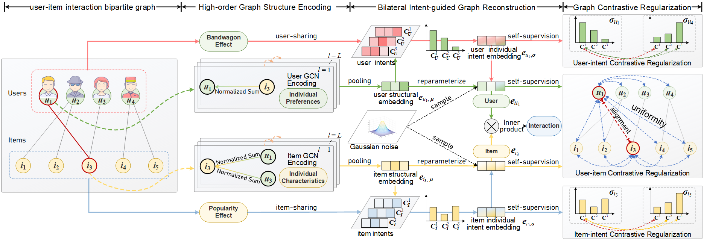

# BIGCF

This is the PyTorch implementation for our SIGIR 2024 paper:
> Yi Zhang, Lei Sang, and Yiwen Zhang*. 2024. [Exploring the Individuality and Collectivity of Intents behind Interactions for Graph Collaborative Filtering](https://arxiv.org/abs/2405.09042). In Proceedings of the 47th International ACM SIGIR Conference on Research and Development in Information Retrieval (SIGIR ’24).

<p align="center">

</p>


## Environment
```
python == 3.8.18
pytorch == 2.1.0 (cuda:12.1)
torch-sparse == 0.6.18
scipy == 1.10.1
numpy == 1.24.3
```

## Examples to run the codes
We adopt three widely used large-scale recommendation datasets: Gowalla, Amazon-Book, and Tmall. BIGCF is an easy-to-use recommendation model in which the most important hyperparameter is the weight of the contrastive loss `ssl_reg`, and the other parameters can be set by default. The following are examples of runs on three datasets:

- Gowalla:

  `python main.py --dataset gowalla --epoch 150 --ssl_reg 0.4`
- Amazon-Book:

  `python main.py --dataset amazon --epoch 150 --ssl_reg 0.4`
- Tmall:

  `python main.py --dataset tmall --epoch 150 --ssl_reg 0.2`
